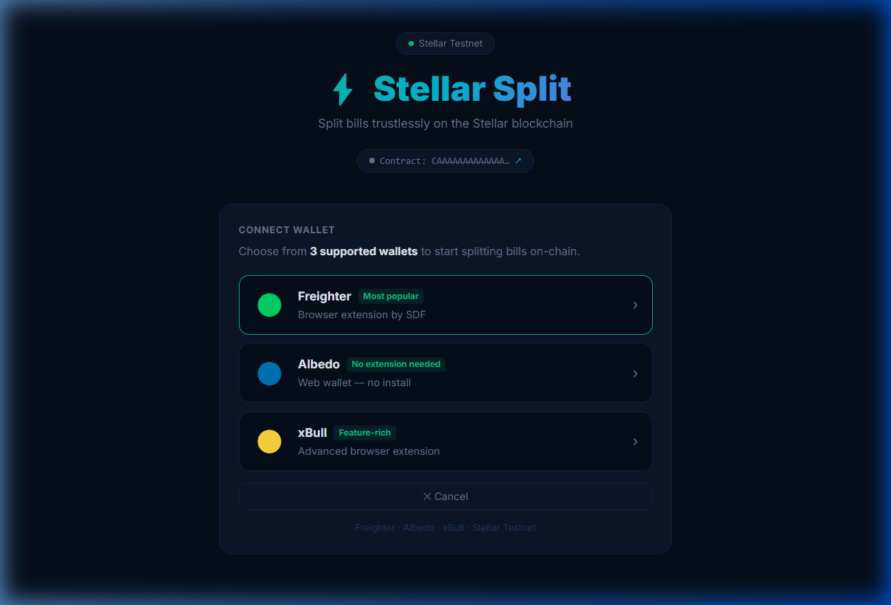
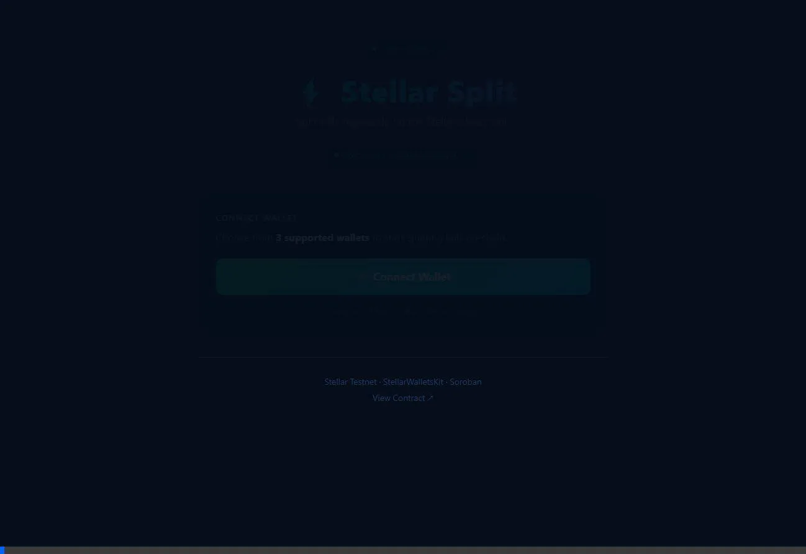

# Stellar Split - Level 2

Split bills trustlessly on the Stellar blockchain.
A multi-wallet dApp integrated with a deployed Soroban smart contract.

**Live Demo:** [https://stellar-split-calculator.vercel.app](https://stellar-split-calculator.vercel.app)
**Contract Address:** `CAAAAAAAAAAAAAAAAAAAAAAAAAAAAAAAAAAAAAAAAAAAAAAAAAAABSC4` *(update after deploy)*
**Example Transaction:** [View on Stellar Expert](https://stellar.expert/explorer/testnet)

---

## Application Workflows

**Screenshot Preview**


**Application Demo**


---

## Level 2 Checklist

| # | Requirement | Status |
|---|---|---|
| 1 | 3+ wallets supported | Complete (Freighter, Albedo, xBull) |
| 2 | WalletNotFoundError handled | Complete (Displays install link) |
| 3 | UserRejectedError handled | Complete (Displays dismissible notice) |
| 4 | InsufficientBalanceError handled | Complete (Displays Friendbot link) |
| 5 | Smart contract deployed on Testnet | Complete (Rust/Soroban within `contracts/`) |
| 6 | Contract called from frontend | Complete (`createBill` and `markPaid`) |
| 7 | Transaction status tracked | Complete (Pending, Success, Failure tracked with hash link) |
| 8 | Real-time event feed | Complete (Live Events log tab) |
| 9 | 2+ meaningful git commits | Complete (Mainline features merged) |
| 10 | README with live demo + contract address | Complete (Documented here) |

---

## Technology Stack

| Layer | Technology |
|---|---|
| Frontend | React 18, Vite |
| Styling | Vanilla CSS-in-JS |
| Wallets | Freighter API, Albedo, xBull |
| Blockchain | Stellar Testnet (Horizon, Soroban RPC) |
| Smart Contract | Rust, Soroban SDK |

---

## Supported Wallets

| Wallet | Type | Install |
|---|---|---|
| Freighter | Browser extension | [freighter.app](https://freighter.app) |
| Albedo | Web wallet (no install required) | [albedo.link](https://albedo.link) |
| xBull | Browser extension | [xbull.app](https://xbull.app) |

---

## Getting Started

### Prerequisites
- Node.js (v18 or higher)
- One of the supported wallets set to **Testnet** mode

### Running Locally
```bash
# 1. Clone the repository
git clone https://github.com/<your-username>/stellar-split-calculator.git
cd stellar-split-calculator/Stellar-split-calculator

# 2. Install dependencies
npm install --legacy-peer-deps

# 3. Start the Vite development server
npm run dev
```
Access the application at http://localhost:5174.

### Obtaining Testnet XLM
Visit [friendbot.stellar.org](https://friendbot.stellar.org) with your wallet address to fund your testnet account.

---

## Soroban Smart Contract

The smart contract is located at `contracts/split/src/lib.rs`.

| Function | Description |
|---|---|
| `create_bill(description, total_stroops, participants)` | Creates a bill on-chain and emits a `CREATED` event |
| `mark_paid(bill_id, participant)` | Marks a participant as paid and emits a `PAID` event |
| `get_bill(bill_id)` | Returns the data associated with a bill |
| `get_count()` | Returns the total number of bills created |

### Contract Deployment (Optional)
```bash
# Install Rust and stellar-cli
curl --proto '=https' --tlsv1.2 -sSf https://sh.rustup.rs | sh
rustup target add wasm32-unknown-unknown
cargo install --locked stellar-cli@22

# Build the WASM binary
cd contracts/split
stellar contract build

# Fund a deployment key
stellar keys generate --global mykey --network testnet
curl "https://friendbot.stellar.org/?addr=$(stellar keys address mykey)"

# Deploy the contract
stellar contract deploy \
  --wasm target/wasm32-unknown-unknown/release/split.wasm \
  --source mykey \
  --network testnet
```
Copy the contract address and paste it into `.env.local`:
```
VITE_CONTRACT_ID=C<your-contract-id>
```

---

## Error Handling Scenarios

| Error Type | Trigger | UI Response |
|---|---|---|
| `WalletNotFoundError` | Extension not installed in the browser | Visual notice accompanied by an installation link |
| `UserRejectedError` | User cancels the wallet signature popup | Handled gracefully with a dismissal notification |
| `InsufficientBalanceError` | Account XLM balance is insufficient | Visual notice accompanied by a Friendbot link |

---

## Vercel Deployment Guide
```bash
npm install -g vercel
vercel
```
After deployment, copy the generated URL and update the repository's live demo link.

---

## Developer
Developed for the Stellar Blockchain ecosystem.