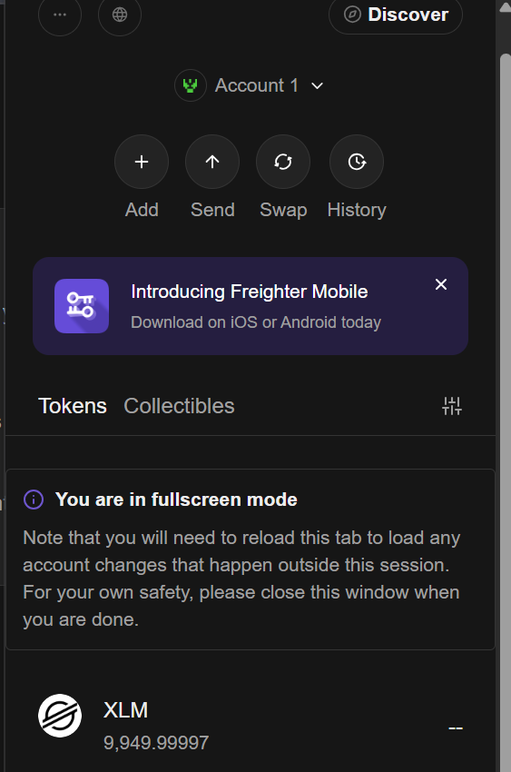
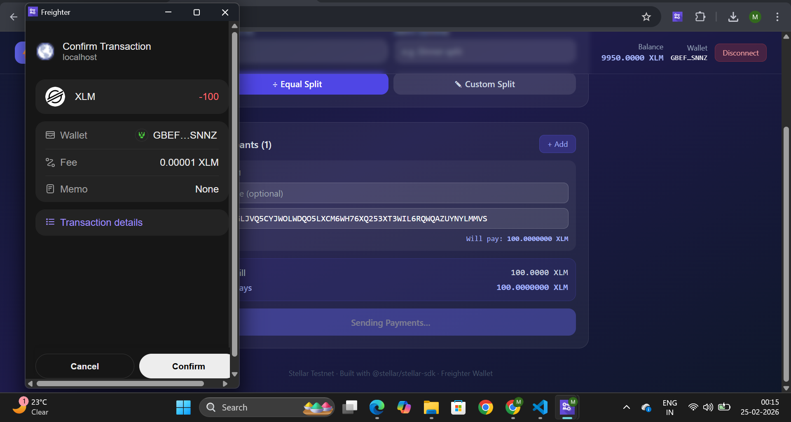
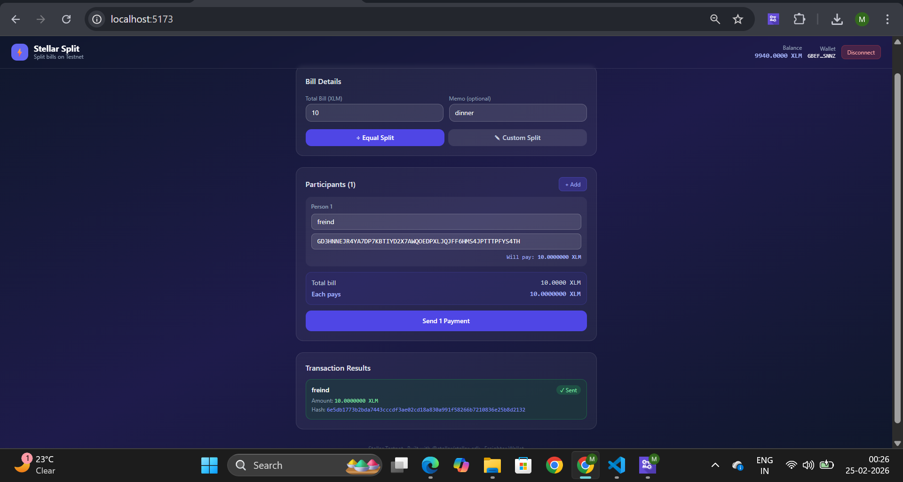
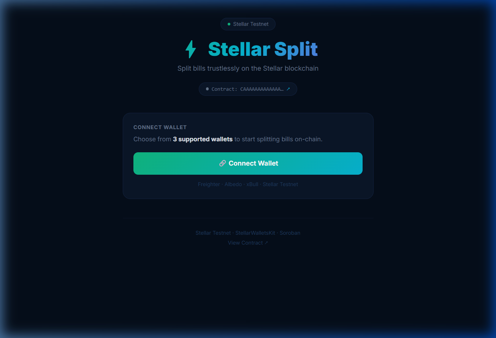
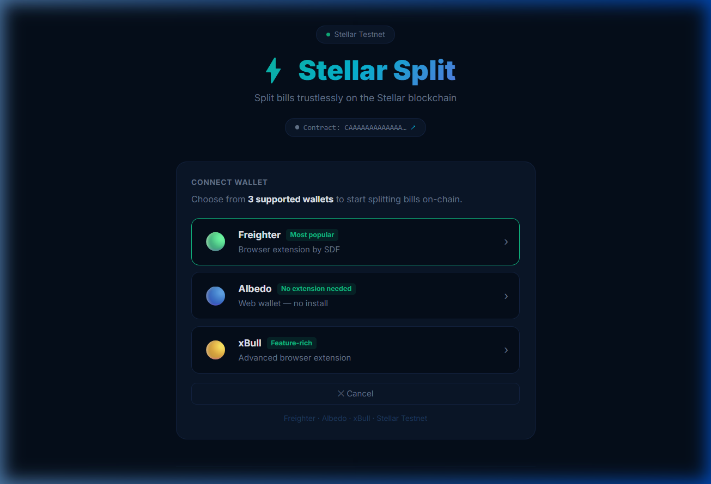

# ⚡ Stellar Split

### Trustless Bill Splitting on the Stellar Blockchain

[](https://stellar-split-calculator.vercel.app)
[](https://stellar.org)
[](LICENSE)

*Developed as part of the **Rise In Stellar White Belt Program***

---

## 📌 Table of Contents

- [Project Overview](#-project-overview)
- [Live Links](#-live-links)
- [Architecture Evolution](#-architecture-evolution)
- [Technology Stack](#-technology-stack)
- [Supported Wallets](#-supported-wallets)
- [Level 1 — Wallet-Based Bill Splitting](#-level-1--wallet-based-bill-splitting)
- [Level 2 — Soroban Smart Contract dApp](#-level-2--soroban-smart-contract-dapp)
- [Soroban Smart Contract](#-soroban-smart-contract)
- [Error Handling](#-error-handling)
- [Local Development Setup](#-local-development-setup)
- [Smart Contract Deployment](#-smart-contract-deployment-optional)
- [Future Improvements](#-future-improvements)

---

## 🌟 Project Overview

**Stellar Split** is a decentralized bill-splitting application built on the Stellar Testnet. It allows users to split expenses and settle payments in XLM, evolving from a simple wallet-based payment tool into a fully trustless dApp powered by Soroban smart contracts.

### What the application enables:

| Capability | Description |
|---|---|
| 💸 Bill Splitting | Divide expenses equally or by custom amounts |
| 🔗 On-chain Payments | Send XLM directly to multiple participants on Testnet |
| 📋 Contract Interaction | Create and track bills via Soroban smart contract |
| 🔍 Transaction Verification | View every payment on Stellar Expert |
| 🔔 Real-time Events | Live blockchain event feed |

---

## 🔗 Live Links

| Resource | Link |
|---|---|
| 🌐 **Live Application** | [stellar-split-calculator.vercel.app](https://stellar-split-calculator.vercel.app) |
| 📁 **Source Code** | [github.com/MrunalGhorpade13/Stellar-split-calculator](https://github.com/MrunalGhorpade13/Stellar-split-calculator) |
| 🔎 **Example Transaction** | [View on Stellar Expert](https://stellar.expert/explorer/testnet/tx/6e5db1773b2bda7443cccdf3ae02cd18a830a991f58266b7210836e25b8d2132) |
| 🎬 **App Demo** | [DEMO.md](./DEMO.md) |

---

## 🏗️ Architecture Evolution

| Level | Name | Description |
|---|---|---|
| **Level 1** | Wallet-Based | Direct XLM payments via Freighter wallet on Stellar Testnet |
| **Level 2** | Trustless dApp | Multi-wallet support + Soroban smart contract for on-chain bill management |

---

## 🛠️ Technology Stack

| Layer | Technology | Purpose |
|---|---|---|
| **Frontend** | React 18 | Component-based UI framework |
| **Build Tool** | Vite | Dev server and production bundler |
| **Styling** | Tailwind CSS | Utility-first CSS framework |
| **Blockchain SDK** | `@stellar/stellar-sdk` v12 | Transaction construction and Horizon API |
| **Wallet API** | `@stellar/freighter-api` v2 | Wallet connection and signing |
| **Smart Contracts** | Rust + Soroban SDK | On-chain bill logic |
| **Network** | Stellar Testnet (Horizon) | Blockchain state and transaction submission |
| **Infrastructure** | Vercel | Cloud hosting and CI/CD |

---

## 👛 Supported Wallets

| Wallet | Type | Note | Install |
|---|---|---|---|
| 🟢 **Freighter** | Browser Extension | Most popular · Official SDF wallet | [freighter.app](https://freighter.app) |
| 🔵 **Albedo** | Web Wallet | No extension needed | [albedo.link](https://albedo.link) |
| 🟡 **xBull** | Browser Extension | Feature-rich · Advanced users | [xbull.app](https://xbull.app) |

---

## 🥇 Level 1 — Wallet-Based Bill Splitting

Level 1 demonstrates core Stellar blockchain integration via the Freighter wallet and Horizon API.

### Features

| Feature | Description |
|---|---|
| **Wallet Connection** | Connect and disconnect Freighter wallet securely |
| **Live Balance** | Fetch real-time XLM balance from Horizon Testnet API |
| **Equal Split** | Auto-divide a bill equally among all participants |
| **Custom Split** | Set individual amounts per participant |
| **Transaction Memo** | Attach a label (max 28 chars) to each payment |
| **Verification** | Deep link to Stellar Expert with transaction hash |

### ✅ Level 1 Checklist

| Requirement | Status |
|---|---|
| Freighter wallet setup on Testnet | ✅ Complete |
| Wallet connect functionality | ✅ Complete |
| Wallet disconnect functionality | ✅ Complete |
| Fetch XLM balance from Horizon | ✅ Complete |
| Display balance clearly in UI | ✅ Complete |
| Send XLM transaction on Testnet | ✅ Complete |
| Show success state with transaction hash | ✅ Complete |
| Show failure state with error code | ✅ Complete |
| Public GitHub repository | ✅ Complete |
| Deployed public URL | ✅ Complete |

---

### 📸 Level 1 — Proof of Work

**Confirmed Testnet Transaction Hash:**

```
6e5db1773b2bda7443cccdf3ae02cd18a830a991f58266b7210836e25b8d2132
```

| Detail | Value |
|---|---|
| **Wallet Address** | `GBEF...SNNZ` |
| **Network** | Stellar Testnet (Test SDF Network ; September 2015) |
| **Horizon Endpoint** | `https://horizon-testnet.stellar.org` |

---

**Freighter Wallet — Balance Display (9,949.99997 XLM)**



---

**Freighter Wallet — Transaction Confirmation Popup**



---

**Live Application — Bill Split & Transaction Sent with Hash**



---

## 🥈 Level 2 — Soroban Smart Contract dApp

Level 2 upgrades the application into a fully decentralized bill manager using Soroban smart contracts and multi-wallet support via StellarWalletsKit.

### Features

| Feature | Description |
|---|---|
| **Multi-Wallet Support** | Freighter, Albedo, xBull via StellarWalletsKit |
| **Soroban Smart Contract** | Rust contract deployed on Stellar Testnet |
| **On-chain Bill Creation** | Bills stored entirely on-chain via `create_bill` |
| **Payment Tracking** | Mark participants as paid via `mark_paid` |
| **Real-time Event Feed** | Live contract events rendered in the UI |
| **Transaction Lifecycle** | Pending → Success / Failure tracked with hash link |

### ✅ Level 2 Checklist

| # | Requirement | Status |
|---|---|---|
| 1 | 3+ wallets supported | ✅ Complete — Freighter, Albedo, xBull |
| 2 | `WalletNotFoundError` handled | ✅ Complete — shows installation link |
| 3 | `UserRejectedError` handled | ✅ Complete — dismissible notification |
| 4 | `InsufficientBalanceError` handled | ✅ Complete — Friendbot funding link |
| 5 | Smart contract deployed on Testnet | ✅ Complete |
| 6 | Contract called from frontend | ✅ Complete — `createBill` + `markPaid` |
| 7 | Transaction status tracked | ✅ Complete — Pending, Success, Failure |
| 8 | Real-time event feed | ✅ Complete — Live Events log tab |
| 9 | 2+ meaningful git commits | ✅ Complete |
| 10 | README with live demo and contract address | ✅ Complete |

---

### 📸 Level 2 — Proof of Work

**Level 2 App — Main Screen with Soroban Contract Connected**



---

**Level 2 App — Multi-Wallet Selection Modal (Freighter · Albedo · xBull)**



---

## 🔐 Soroban Smart Contract

The smart contract is written in Rust using the Soroban SDK.

**Location:** `contracts/split/src/lib.rs`

| Function | Signature | Description |
|---|---|---|
| `create_bill` | `(description, total_stroops, participants)` | Creates a new bill on-chain; emits `CREATED` event |
| `mark_paid` | `(bill_id, participant)` | Marks a participant as paid; emits `PAID` event |
| `get_bill` | `(bill_id)` | Returns all data associated with a bill |
| `get_count` | `()` | Returns the total count of bills created |

---

## ⚠️ Error Handling

| Error Type | Trigger Condition | UI Response |
|---|---|---|
| `WalletNotFoundError` | Wallet extension not installed in the browser | Visual alert with installation link |
| `UserRejectedError` | User cancels the wallet signing popup | Dismissible notification shown |
| `InsufficientBalanceError` | Account XLM balance is too low | Alert with Friendbot funding link |

---

## 💻 Local Development Setup

### Prerequisites

| Requirement | Version | Notes |
|---|---|---|
| Node.js | v18+ | [nodejs.org](https://nodejs.org) |
| Browser | Chrome / Chromium | Required for wallet extensions |
| Freighter | Latest | Set network to **Stellar Testnet** |

### Installation

```bash
# Clone the repository
git clone https://github.com/MrunalGhorpade13/Stellar-split-calculator.git
cd Stellar-split-calculator

# Install dependencies
npm install

# Start the development server
npm run dev
```

Open `http://localhost:5174` in your browser.

### Funding Your Testnet Account

```
https://friendbot.stellar.org?addr=YOUR_PUBLIC_KEY
```

Stellar Friendbot will automatically credit **10,000 test XLM** to your wallet.

---

## 🚀 Smart Contract Deployment (Optional)

```bash
# 1. Install Rust and Stellar CLI
curl --proto '=https' --tlsv1.2 -sSf https://sh.rustup.rs | sh
rustup target add wasm32-unknown-unknown
cargo install --locked stellar-cli@22

# 2. Build the WASM binary
cd contracts/split
stellar contract build

# 3. Fund a deployment key
stellar keys generate --global mykey --network testnet
curl "https://friendbot.stellar.org/?addr=$(stellar keys address mykey)"

# 4. Deploy the contract
stellar contract deploy \
  --wasm target/wasm32-unknown-unknown/release/split.wasm \
  --source mykey \
  --network testnet
```

Add the returned contract address to `.env.local`:

```env
VITE_CONTRACT_ID=C<your-contract-address>
```

### Vercel Deployment

```bash
npm install -g vercel
vercel
```

---

## 🔮 Future Improvements

| Improvement | Description |
|---|---|
| 📱 Mobile Wallets | Mobile wallet support (WalletConnect v2) |
| 🔔 Payment Reminders | Group notifications for unpaid participants |
| 🔗 Bill Sharing | Share a bill via unique URL |
| 📡 Payment Streaming | Real-time payment streaming using Soroban |
| 📊 Analytics Dashboard | Spending trends and payment history |

---

**Developer:** Mrunal Ghorpade

**GitHub:** [@MrunalGhorpade13](https://github.com/MrunalGhorpade13)

*Built for the Stellar Blockchain Ecosystem · Rise In White Belt Program*
